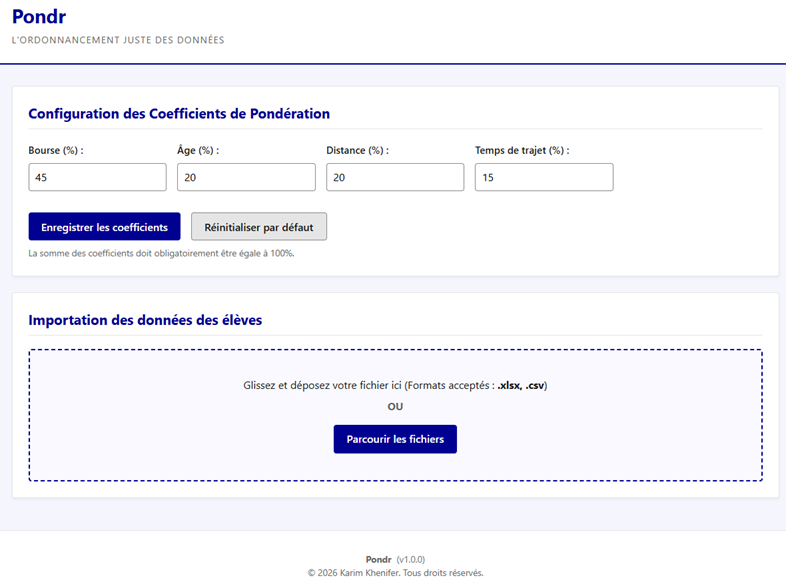

# Pondr


> **Pondr** est une application web locale permettant de produire un 
> classement multicritère objectif, transparent et reproductible à
> partir de critères pondérés configurables.
> Version en ligne : https://karim-khfr.github.io/pondr-eple/



------------------------------------------------------------------------

# Sommaire

-   Présentation
-   Pourquoi Pondr ?
-   Fonctionnalités
-   Public visé
-   Cas d'usage
-   Aperçu
-   Architecture
-   Algorithme
-   Sécurité
-   Installation
-   Utilisation
-   Structure du projet
-   Dépendances
-   Performances
-   Feuille de route
-   Auteur
-   Licence

------------------------------------------------------------------------

# Présentation

Pondr est une application Web monopage (SPA) développée exclusivement en
**HTML**, **CSS** et **JavaScript natif**.

Le logiciel exécute l'intégralité des traitements directement dans le
navigateur de l'utilisateur. Aucune donnée n'est transmise à un serveur.

Initialement conçu pour automatiser le classement des demandes d'accès
au régime **interne‑externé** des EPLE, Pondr peut être adapté à tout
processus de sélection reposant sur plusieurs critères pondérés.

------------------------------------------------------------------------

# Pourquoi Pondr ?

Les commissions d'admission doivent pouvoir justifier leurs décisions.

Pondr répond à quatre exigences :

-   objectivité ;
-   transparence ;
-   reproductibilité ;
-   traçabilité.

L'application fournit un classement calculé selon des règles connues à
l'avance et paramétrables.

La décision finale demeure celle de l'établissement.

------------------------------------------------------------------------

# Fonctionnalités

-   Import Excel (.xlsx)
-   Import CSV
-   Validation complète des données
-   Rapport des anomalies
-   Pondérations configurables
-   Classement multicritère
-   Recherche instantanée
-   Tri dynamique
-   Export Excel
-   Export CSV
-   Feuille d'audit
-   Fonctionnement hors ligne
-   Stockage local des préférences
-   Interface accessible
-   Mapping dynamique des colonnes à l'import (plus besoin de renommer le fichier Excel)

------------------------------------------------------------------------

# Public visé

-   Chefs d'établissement
-   Secrétaires généraux
-   Développeurs
-   Administrations
-   Toute structure souhaitant classer objectivement des candidatures.

------------------------------------------------------------------------

# Cas d'usage

-   Attribution du régime interne‑externé
-   Appels à candidatures
-   Sélection de dossiers
-   Classements administratifs
-   Recrutements internes
-   Priorisation multicritère

------------------------------------------------------------------------

# Aperçu

Les captures d'écran seront ajoutées prochainement.

``` text
assets/screenshots/
 ├── accueil.png
 ├── import.png
 ├── classement.png
 └── export.png
```

------------------------------------------------------------------------

# Architecture

``` text
Utilisateur
      │
      ▼
Import Excel / CSV
      │
      ▼
Validation
      │
      ▼
Normalisation
      │
      ▼
Calcul des scores
      │
      ▼
Classement
      │
      ▼
Exports
```

------------------------------------------------------------------------

# Algorithme

L'algorithme repose sur trois étapes.

## 1. Normalisation

Les critères sont convertis sur une échelle commune de 0 à 100.

Critères :

-   Bourse
-   Âge
-   Distance
-   Temps de trajet
-   Revenu fiscal de référence

## 2. Pondération

Configuration par défaut :

  Critère      Poids
  ---------- -------
  Bourse        40 %
  Âge           20 %
  Distance      20 %
  RFR           10 %
  Temps         10 %

La somme doit toujours être égale à 100 %.

## 3. Départage

En cas d'égalité :

1.  Score global
2.  Score bourse
3.  Score âge
4.  Revenu fiscal de référence
5.  Score distance
6.  Score temps
7.  Ordre alphabétique

------------------------------------------------------------------------

# Sécurité

## Confidentialité

-   100 % local
-   aucune base de données
-   aucun serveur
-   aucune API métier

## Sécurité & Intégrité des données

L'application intègre des mécanismes stricts pour garantir la fiabilité des classements et la sécurité des exports :

- **Validation stricte (Regex) & Types robustes** : Rejet des chaînes parasites dans les champs numériques (ex: "15 km", "120abc") et utilisation de `Number.isFinite` pour bloquer les valeurs aberrantes.
- **Contrôle anti-débordement calendaire** : Validation de l'existence réelle des dates (ex: blocage du "31 février") pour garantir l'exactitude du calcul des âges.
- **Intégrité du Mapping** : Contrôle d'unicité par structure d'ensemble (`Set`) empêchant d'allouer une même colonne à plusieurs critères d'évaluation.
- **Protection contre les injections de formules (CSV Injection)** : Neutralisation systématique des caractères de contrôle (`=`, `+`, `-`, `@`) au début des champs texte lors de l'export Excel/CSV pour protéger le tableur de l'utilisateur final.
- **Protection XSS & Injection HTML** : Échappement des flux de données avant injection dans le DOM (Architecture Vanilla JS sécurisée).

------------------------------------------------------------------------

# Installation

``` bash
git clone https://github.com/<utilisateur>/Pondr.git
```

Puis ouvrir simplement :

``` text
index.html
```

Aucun serveur n'est nécessaire.

------------------------------------------------------------------------

# Utilisation

1.  Configurer les coefficients.
2.  Configurer la date de référence pour le calcul de l'âge (rentrée scolaire).
2.  Importer le fichier.
3.  Lancer le classement.
4.  Vérifier les anomalies.
5.  Exporter les résultats.

------------------------------------------------------------------------

# Structure

``` text
Pondr/
│
├── index.html
├── css/
├── js/
│   ├── app.js
│   ├── parser.js
│   ├── validation.js
│   ├── scoring.js
│   ├── table.js
│   ├── export.js
│   └── utils.js
├── docs/
└── README.md
```

------------------------------------------------------------------------

# Dépendances

-   SheetJS (lecture/écriture Excel)

------------------------------------------------------------------------

# Performances

-   traitement incrémental
-   interface fluide
-   exports rapides
-   prise en charge de fichiers volumineux
-   traitement entièrement côté client

------------------------------------------------------------------------

# Feuille de route

-   Captures d'écran
-   Internationalisation
-   Profils de pondération
-   Historique des traitements
-   Signature numérique des exports

------------------------------------------------------------------------

# Auteur

**Karim Khenifer**

© 2026 Karim Khenifer

------------------------------------------------------------------------

# Licence

Voir le fichier `LICENSE.md`.

L'utilisation est gratuite pour les usages personnels, éducatifs,
institutionnels et administratifs.

Toute exploitation commerciale nécessite l'autorisation écrite préalable
de l'auteur.
